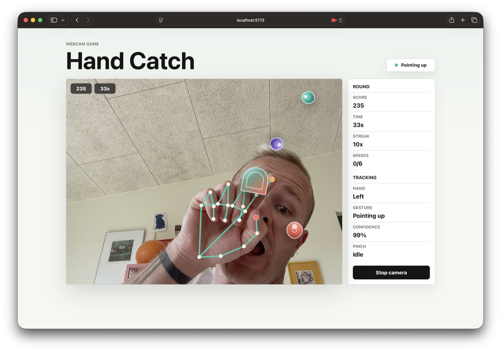
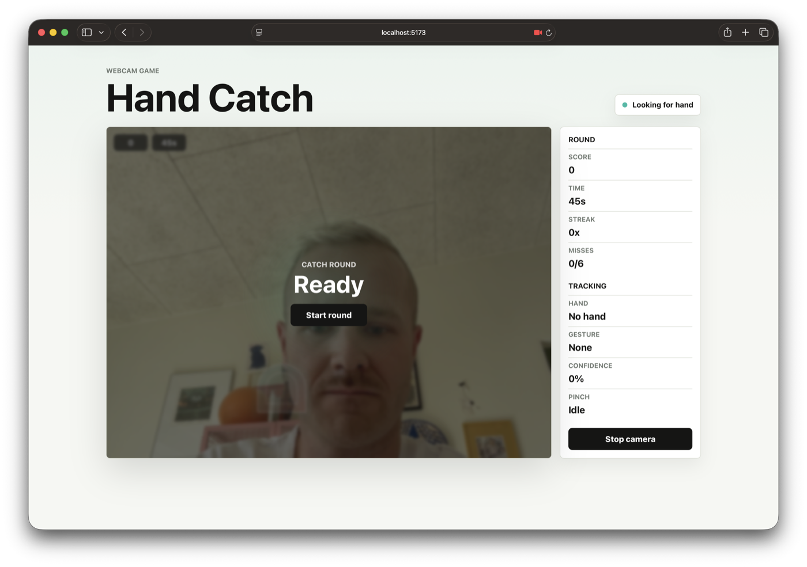
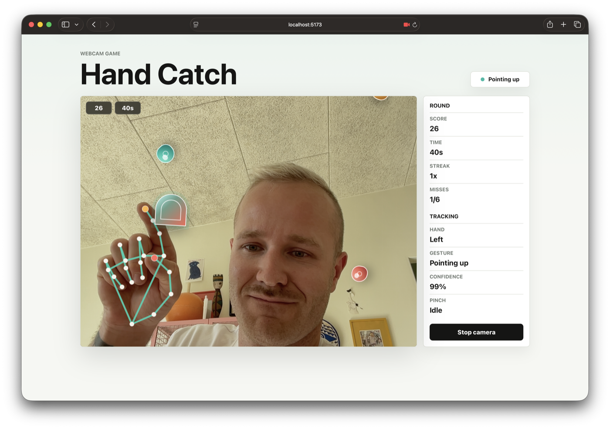

# Hand Catch

Hand Catch is a small webcam game made with React and MediaPipe hand tracking.
Your index finger controls the puck. Catch the falling targets before they leave
the stage.

This project builds on a simple hand-tracking puck idea, then adds a game loop,
score, timer, falling targets, and a few easy places to customize the game.



## What You Are Building

This is not a normal keyboard or mouse game. The player controls the game with
their hand in front of the webcam.

The browser shows a live camera image. MediaPipe looks at that image and finds
important points on the hand, called landmarks. The project uses the index
finger landmark to move the puck around the game area.

The game then checks whether the puck touches a falling target. If it does, the
player gets points. If the target falls past the bottom of the stage, it counts
as a miss.

The goal of the project is to understand how a webcam input can become an
interactive game mechanic.

## How the Project Works

The project has three main parts:

1. Hand tracking
2. Game logic
3. User interface

### 1. Hand Tracking

Hand tracking happens in:

```text
src/hooks/useHandTracking.js
src/handTracking.js
src/gestures.js
```

The webcam gives the browser a video frame. MediaPipe reads that frame and
returns hand landmarks. A landmark is a point on the hand, such as the wrist,
thumb tip, or index finger tip.

The project uses the index finger tip to decide where the puck should move.

### 2. Game Logic

Game logic happens in:

```text
src/hooks/useCatchGame.js
```

This file controls the rules of the game:

- how long a round lasts
- how many misses are allowed
- when new targets appear
- how fast targets fall
- when a target is caught
- how many points the player gets

This is the best file to edit first if you want to change how the game feels.

### 3. User Interface

The user interface happens mostly in:

```text
src/App.jsx
src/components/TrackingStage.jsx
src/components/ControlPanel.jsx
src/App.css
```

These files decide what the player sees:

- the camera stage
- the puck
- falling targets
- score and time
- buttons
- colors and layout

If you want to change how the game looks, start with `src/App.css`.

## The Data Flow

When the game is running, the project follows this flow:

1. The webcam sends a video frame to the browser.
2. MediaPipe finds the hand landmarks in that frame.
3. `getHandGesture` turns landmarks into useful values.
4. `movePuckWithGesture` moves the puck to the index finger position.
5. `useCatchGame` moves the falling targets.
6. `useCatchGame` checks if the puck touches a target.
7. React updates the score, timer, and visible targets.

This means the game is a loop. Every frame, the app looks at the hand, moves the
puck, moves the targets, checks for collisions, and updates the screen.

## Get the Project Running

Start from this template repository:

```text
https://github.com/cederdorff/hand-catch-game
```

### 1. Create Your Own Copy

Open the template repository in your browser:

[github.com/cederdorff/hand-catch-game](https://github.com/cederdorff/hand-catch-game)

Click `Use this template`.

Choose `Create a new repository`.

Give your repository a clear name, for example:

```text
my-hand-catch-game
```

Create the repository. Now you have your own copy of the project on your GitHub
account.

Do not work directly in the original template repository. Use your own copy.

### 2. Download Your Copy

On your new GitHub repository page, click the green `Code` button.

If you use GitHub Desktop:

1. Choose `Open with GitHub Desktop`.
2. Choose where to save the project on your computer.
3. Click `Clone`.
4. Click `Open in Visual Studio Code`.

If you use the terminal instead, copy your own repository URL and run:

```bash
git clone https://github.com/YOUR-USERNAME/YOUR-REPOSITORY-NAME.git
cd YOUR-REPOSITORY-NAME
code .
```

Replace `YOUR-USERNAME` and `YOUR-REPOSITORY-NAME` with your own GitHub username
and repository name.

### 3. Install the Project

Open the project folder in VS Code.

Open a terminal in VS Code:

```text
Terminal -> New Terminal
```

Install the project dependencies:

```bash
npm install
```

This downloads the code libraries the project needs.

### 4. Start the Development Server

Start the development server:

```bash
npm run dev
```

The terminal will show a local URL, usually:

```text
http://localhost:5173/
```

Open that URL in your browser.

If port `5173` is already being used, Vite may choose another port, such as
`5174`. Use the URL shown in your own terminal.

## How to Play

1. Click `Start camera`.
2. Allow camera access when the browser asks.
3. Hold one hand in front of the camera.
4. Click `Start round`.
5. Move your index finger to move the puck.
6. Catch the falling targets with the puck.

The round lasts `45` seconds and ends early after `6` missed targets.

You can also move the puck with your mouse or trackpad. This is useful when you
want to test the game without using the camera.

## What You Should See

After you click `Start camera`, the camera feed should appear. If the hand has
not been detected yet, the status will say `Looking for hand`. When the camera
is ready, click `Start round`.



When the round starts, targets begin falling through the camera stage. The puck
follows your index finger, and the hand landmarks are drawn on top of the video.



As you catch more targets, the score and streak increase. The side panel shows
the same values as the small HUD in the top-left corner of the game stage.


## What to Notice While Playing

Before you change the code, spend a minute testing the game and watching what
changes on screen.

Look for these details:

- The puck follows your index finger.
- The puck becomes larger when you pinch your thumb and index finger.
- The status pill changes when a hand is detected.
- The score changes when the puck catches a target.
- The miss count changes when a target falls past the bottom.
- The round ends when the timer reaches `0` or the miss limit is reached.

These visible changes connect directly to the code. For example, if you change
the target speed in `useCatchGame.js`, you should immediately see targets fall
faster or slower in the browser.

## If Something Does Not Work

If the camera does not start:

- Check that the browser is asking for camera permission.
- Click `Allow`.
- Make sure no other app is using the webcam.
- Refresh the page and try again.
- Make sure you opened the Vite URL, not `index.html`.

If the page does not update after you change code:

- Save the file you edited.
- Refresh the browser.
- Check the terminal for errors.

If the terminal shows an error:

- Read the first error message.
- Check the file name and line number.
- Make sure brackets, commas, and quotes are still in the right places.

## Important Files

```text
src/App.jsx
```

Puts the app together. This is where the page title, game stage, status pill,
and control panel are connected.

```text
src/components/TrackingStage.jsx
```

Shows the webcam, puck, falling targets, start button, score/time HUD, and round
overlay.

```text
src/components/ControlPanel.jsx
```

Shows the round stats and hand-tracking stats.

```text
src/hooks/useCatchGame.js
```

Runs the game. This file controls the timer, score, target spawning, speed,
misses, and collision checks.

```text
src/hooks/useHandTracking.js
```

Starts and stops the webcam. It sends each video frame to MediaPipe and updates
the puck when a hand is found.

```text
src/gestures.js
```

Turns hand landmarks into simple gesture values. This is where pinch, pointing,
open hand, and puck movement are calculated.

```text
src/App.css
```

Controls the visual design: layout, colors, puck style, falling target style,
buttons, and responsive design.

## How to Make Changes Safely

Change one thing at a time.

After each change:

1. Save the file.
2. Check the browser.
3. Make sure the game still starts.
4. Make sure the thing you changed looks or behaves differently.

If something breaks, the browser or terminal will usually tell you which file has
the problem. Go back to the last thing you edited and check for missing commas,
brackets, quotes, or semicolons.

Good first changes are small number changes, such as:

- round length
- target speed
- target size
- score value
- miss limit

After that, try visual changes, such as colors, puck shape, and target styles.

## Customization 1: Change the Round Length

Open:

```text
src/hooks/useCatchGame.js
```

Find:

```js
const ROUND_SECONDS = 45
```

Try changing it:

```js
const ROUND_SECONDS = 30
```

Save the file and refresh the browser. Your round should now last 30 seconds.

## Customization 2: Change the Number of Misses

Open:

```text
src/hooks/useCatchGame.js
```

Find:

```js
const MAX_MISSES = 6
```

Try making the game easier:

```js
const MAX_MISSES = 10
```

Try making the game harder:

```js
const MAX_MISSES = 3
```

## Customization 3: Make Targets Faster or Slower

Open:

```text
src/hooks/useCatchGame.js
```

Find this part inside `createCatchItem`:

```js
speed: randomBetween(0.18 + paceBoost, 0.28 + paceBoost),
```

For slower targets:

```js
speed: randomBetween(0.12 + paceBoost, 0.2 + paceBoost),
```

For faster targets:

```js
speed: randomBetween(0.28 + paceBoost, 0.42 + paceBoost),
```

Small numbers make the targets fall slowly. Larger numbers make the targets fall
quickly.

## Customization 4: Change the Target Size

Open:

```text
src/hooks/useCatchGame.js
```

Find:

```js
size: randomBetween(34, 54),
```

Make targets larger:

```js
size: randomBetween(50, 80),
```

Make targets smaller:

```js
size: randomBetween(24, 40),
```

## Customization 5: Change the Score

Open:

```text
src/hooks/useCatchGame.js
```

Find this line:

```js
score += 10 + Math.min(streak, 6) * 3
```

The player currently gets `10` points plus a streak bonus.

Try a simple score:

```js
score += 10
```

Try a bigger streak bonus:

```js
score += 10 + Math.min(streak, 10) * 5
```

## Customization 6: Change Target Colors

Open:

```text
src/App.css
```

Find the target color classes:

```css
.catch-target.is-mint {
  background: linear-gradient(135deg, #9af6d8, #1fbba6 58%, #117f76);
}
```

Change the color values to your own colors.

You can also edit these classes:

```css
.catch-target.is-amber
.catch-target.is-coral
.catch-target.is-violet
```

## Customization 7: Add a New Target Type

Open:

```text
src/hooks/useCatchGame.js
```

Find:

```js
const TARGET_KINDS = ['mint', 'amber', 'coral', 'violet']
```

Add a new name:

```js
const TARGET_KINDS = ['mint', 'amber', 'coral', 'violet', 'blue']
```

Then open:

```text
src/App.css
```

Add a matching CSS class:

```css
.catch-target.is-blue {
  background: linear-gradient(135deg, #b9dcff, #4d93ff 58%, #2254a6);
}
```

The name in `TARGET_KINDS` must match the name after `.is-` in the CSS.

## Customization 8: Change the Puck

Open:

```text
src/App.css
```

Find:

```css
.control-object {
```

Try changing:

- `width`
- `border-radius`
- `background`
- `box-shadow`

For example, make the puck more square:

```css
border-radius: 14px;
```

Or change the puck colors:

```css
background:
  linear-gradient(135deg, rgba(255, 255, 255, 0.72), transparent 38%),
  linear-gradient(135deg, #4d93ff, #f3a72e);
```

## Customization 9: Change How the Puck Moves

Open:

```text
src/gestures.js
```

Find this line inside `movePuckToPoint`:

```js
const nextX = currentX + (clamp(x, 0.03, 0.97) - currentX) * 0.26;
```

The number `0.26` controls how quickly the puck follows your hand.

Try a slower puck:

```js
const nextX = currentX + (clamp(x, 0.03, 0.97) - currentX) * 0.12;
const nextY = currentY + (clamp(y, 0.06, 0.94) - currentY) * 0.12;
```

Try a faster puck:

```js
const nextX = currentX + (clamp(x, 0.03, 0.97) - currentX) * 0.45;
const nextY = currentY + (clamp(y, 0.06, 0.94) - currentY) * 0.45;
```

Make sure you change both `nextX` and `nextY`.

## Customization 10: Change Gesture Rules

Open:

```text
src/gestures.js
```

Find:

```js
const isPinching = grip > 0.6;
```

The number `0.6` is the pinch sensitivity.

Make pinching easier:

```js
const isPinching = grip > 0.4;
```

Make pinching harder:

```js
const isPinching = grip > 0.8;
```

The current game does not require pinch to catch targets, but this value still
changes the status panel and puck style. You could use it later to make a game
where targets only count when the player pinches.

## Challenge Ideas

Try one or more of these after the basic customizations:

- Add one target type that removes points.
- Add one target type that gives bonus time.
- Make the game harder every 10 seconds.
- Add a new message when the round ends.
- Change the game from catching falling targets to dodging falling targets.
- Make the puck only catch targets while the player is pinching.
- Add a new metric to the control panel.
- Create your own theme with new colors and target shapes.

## Before You Submit

Run this command to check that the project can build:

```bash
npm run build
```

If the build works, your project is ready to share.

Also test your game in the browser:

- Can the camera start?
- Can you start a round?
- Do targets appear?
- Does the score change when you catch targets?
- Does the layout still look good on a smaller screen?
